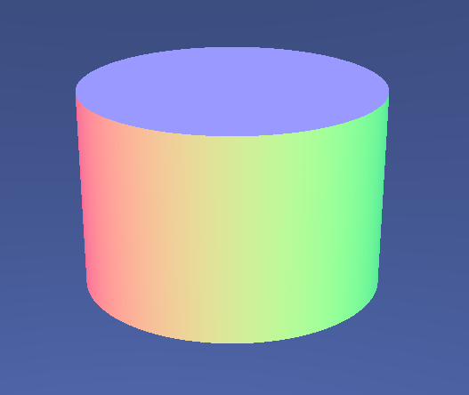

# Maillage de forme
## Introduction
Ce projet a pour objectif d'implémenter des maillages de formes élémentaires (cubes, sphères, cylindres, cônes, tore, etc.) puis de les manipuler à travers des opérations de transformation (translation, rotation, homothétie, etc.) et de déformation.  
Une introduction au concept d'occlusion ambiante est également proposée.

### Caractéristiques
Langage : C++   
Bibliothèque : OpenGl  
Framework : QT (with QT creator)  
Année : 2023  

> _Le code initial structurant l'architecture du projet a été fourni par l'enseignant._

## Table des matières
1. [Installation](#1---installation)
2. [Les productions](#2---les-productions)
3. [Les images](#3---les-images)

## 1-- Installation
L'installation du projet est détaillé dans le fichier [INSTALL.md](INSTALL.md).  
Le projet a été testé sur Windows 10 et Linux Ubuntu 20.04 via QT.

## 2-- Les productions
Voici la liste exhaustive des productions réalisées dans le cadre de ce projet :
- Maillage de formes élémentaires :
    - Cube
    - Cylindre
    - Sphère et/ou demi-sphère
    - Tore
    - Capsule
- Assemblage de forme :
    - Création d'une lampe
- Transformation de formes :
    - Translation
    - Rotation
    - Homothétie
- Déformation de formes :
    - Déformation à partir d'un vecteur
- Occlusion ambiante :
    - Calcul de l'occlusion ambiante
    - Affichage de l'occlusion ambiante
- Fenêtre graphique

## 3-- Les images
Voici quelques rendus de l'application :
### Cylindre

### Sphère

### Tore

### Capsule

### Occlusion ambiante

